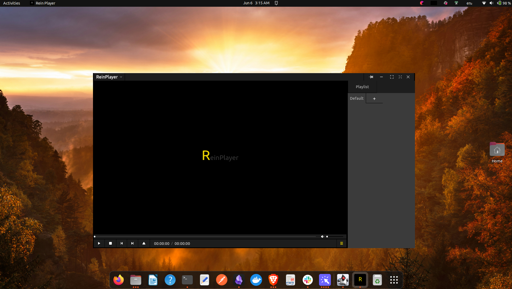

# ReinPlayer 🎬

**A modern, intuitive video player for Linux inspired by PotPlayer.**



---

## 🚀 Introduction

### Why ReinPlayer?

As a developer transitioning fully to Linux, I faced a surprising barrier: my favorite tools weren't available. Two of them kept me tied to Windows:

- Internet Download Manager (IDM)
- PotPlayer

I eventually found a good alternative to IDM, but PotPlayer remained unmatched. Tools like VLC and SMPlayer are powerful, yet they lack the seamless and intuitive experience PotPlayer offers, especially with playlist management.

#### Key Missing Features in Other Players:

- Playlists are saved as files and don't persist between sessions.
- Doesn't auto-load all similar files in a folder when opening a video (e.g., play next episode automatically)
- Must manually open playlist files, unlike PotPlayer's built-in view.
- Doesn't resume playback from the last played video
- Interfaces can feel clunky or unintuitive etc

I decided to build only what I need. **ReinPlayer** captures the essential experience I missed on Linux.

---

## 🛠️ Solutions I Explored

Before building ReinPlayer, I attempted a few alternatives:

- Searched for Linux players with similar playlist behavior.
- Tried installing PotPlayer with Wine.
- Attempted Steam-based installation (unsuccessful due to constant crashes).

---

## 💡 Why Flutter?

With a background in **Java** and **C#**, you might ask why I chose Flutter over something like Avalonia or JavaFX.

The answer is simple: I plan to build cross-platform mobile apps in the future, and Flutter is my tool of choice. ReinPlayer was a perfect opportunity to deepen my Flutter experience.

---

## 🧩 Architecture

ReinPlayer follows the **MVVM** architecture along with a hybrid **feature + layered** approach.

- `common` – Shared widgets, logic, helpers.
- `playback` – Playback screen, video/audio controls.
- `playlist` – Album and playlist management.
- `settings` – User preferences and configuration.
- `player_frame` – Window actions (minimize, maximize, fullscreen, etc.)
- `developer` – Developer tools and logs.

📚 Read more about the architecture here: [Flutter App Architecture Guide](https://docs.flutter.dev/app-architecture/guide)

---

## ⚙️ Features

### 🖥️ Player

- Modern, intuitive UI
- Supports all FFmpeg-compatible video formats ([see full list](https://www.ffmpeg.org/general.html#Video-Codecs))
- Responsive keyboard shortcuts:

| Key                 | Action                  |
| ------------------- | ----------------------- |
| Spacebar            | Pause / Play            |
| m                   | Mute / Unmute           |
| Ctrl + h            | Show / Hide Subtitles   |
| Esc                 | Toggle Fullscreen       |
| Enter               | Maximize / Minimize     |
| Right Arrow         | Seek Forward            |
| Left Arrow          | Seek Backward           |
| Shift + Right Arrow | Big Seek Forward        |
| Shift + Left Arrow  | Big Seek Backward       |
| Up Arrow            | Volume Up               |
| Down Arrow          | Volume Down             |
| Ctrl + b            | Toggle Playlist Window  |
| x                   | Decrease Playback Speed |
| c                   | Increase Playback Speed |
| Page Up             | Goto Previous Video     |
| Page Down           | Goto Next Video         |

- Window actions (Always-on-top, minimize, maximize, fullscreen, close)
- Player controls: Play, Pause, Stop, Open, Next, Previous
- Drag-and-drop support for files and folders
- Playlist panel
- Settings menu
- Adaptive seeking speed based on video length
- Volume control (0-100%) - But internally it's 0-200% because my pc speakers are not that loud 🤣
- Integrate with GNOME to show as default video player if installed with the install script

---

### 🎵 Playlist

- Create and manage playlists
- Persistent playlists without needing to save/import manually
- Resume playback from the last played video
- Auto-load all videos in a dropped folder into a default album
- Auto-load all similar files in a folder when opening a video (e.g., play next episode automatically)

---

### 💬 Subtitles

- Auto-load subtitles from the same folder as the video
- Manual subtitle loading
- Enable / Disable subtitles

---

## 🎯 Challenges & Future Improvements

### Challenges Overcome

- **Packaging Complexity**: Snap packaging proved challenging due to persistent LXD container issues. Switched to AppImage for a more streamlined distribution approach. 😅

- **Menu Architecture**: Implementing a player menu with unlimited nesting capability required significant effort. While the current implementation supports unlimited depth, there's still room for optimization and refinement.
- I'm not a professional Flutter developer, so I'm sure there are many things that could be improved.

### Current Challenges

**Code**

- As a personal project, documentation wasn't the primary focus
- Code could benefit from:
  - A lot of refactoring 😂
  - Better documentation of complex logic
  - Clearer naming conventions
  - Additional inline documentation

## 📦 Downloads

All builds are available in the [releases page](https://github.com/Ahurein/rein_player/releases/tag/v1.0.0).

### 🔥 Recommended Installation

**Snap Package (Recommended)**

- ✅ Easy installation
- ✅ Sandboxed security
- ✅ All dependencies included
- ✅ Automatic desktop integration

| Version | Format         | Download URL                                                                                                              |
| ------- | -------------- | ------------------------------------------------------------------------------------------------------------------------- |
| v1.0.1  | Snap, AppImage, Windows, Debian, Portable          | [GitHub Releases](https://github.com/Ahurein/rein_player/releases/tag/v1.0.1)                                 |

Download player icon: [Download](https://github.com/Ahurein/rein_player/raw/main/assets/images/reinplayer.png)


### ✅ Supported Platforms

| OS          | Supported | Notes                                                                                                               |
| ----------- | --------- | ------------------------------------------------------------------------------------------------------------------- |
| **Linux**   | ✅        | Fully supported                                                                                                     |
| **Windows** | ✅        | Fully supported (But honestly use PotPlayer instead unless you are just trying out ReinPlayer)                      |
| **macOS**   | ❌        | Currently not supported. Want to help? Reach out and let's build a macOS version together as I don't have a Mac 😅. |
| **Android** | ❌        | Not supported – designed for desktop use                                                                            |
| **iOS**     | ❌        | Not supported – designed for desktop use                                                                            |

---

## 📥 Installation Guide

### 🥇 Method 1: Snap Package (Recommended)

**Download the snap file from the release page and install from local file:**

```bash
sudo snap install --dangerous reinplayer_linux_amd64.snap
```

**Benefits:**

- ✅ All dependencies included
- ✅ Sandboxed security
- ✅ Perfect desktop integration
- ✅ No additional setup required

---

### 🥈 Method 2: AppImage (Portable)

**For other installation methods (AppImage, Portable, or Debian), Sometimes, you need to install these dependencies first:**

```bash
# Install required dependencies
sudo apt install zenity libmpv-dev libmpv2

# Create compatibility symlinks (choose one that works for your system)
# Option 1:
sudo ln -s /usr/lib/x86_64-linux-gnu/libmpv.so.2 /usr/lib/x86_64-linux-gnu/libmpv.so.1

# Option 2 (alternative path):
sudo ln -s /usr/lib/x86_64-linux-gnu/libmpv.so /usr/lib/libmpv.so.1
```

**Then run AppImage:**

```bash
chmod +x ReinPlayer-x86_64_v1-0-0.AppImage
./ReinPlayer-x86_64_v1-0-0.AppImage
```

---

### 🥉 Method 3: Debian Package

**Install dependencies first:**

```bash
sudo apt install zenity libmpv-dev libmpv2

# Create compatibility symlinks (choose one that works for your system)
sudo ln -s /usr/lib/x86_64-linux-gnu/libmpv.so.2 /usr/lib/x86_64-linux-gnu/libmpv.so.1
# OR
sudo ln -s /usr/lib/x86_64-linux-gnu/libmpv.so /usr/lib/libmpv.so.1
```

**Then install package:**

```bash
sudo dpkg -i reinplayer_linux_amd64.deb
sudo apt-get install -f  # Fix any dependency issues
```

---

### 🏃 Method 4: Portable Bundle

**Install dependencies first:**

```bash
sudo apt install zenity libmpv-dev libmpv2

# Create compatibility symlinks
sudo ln -s /usr/lib/x86_64-linux-gnu/libmpv.so.2 /usr/lib/x86_64-linux-gnu/libmpv.so.1
# OR
sudo ln -s /usr/lib/x86_64-linux-gnu/libmpv.so /usr/lib/libmpv.so.1
```

**Then extract and run:**

```bash
tar -xzf reinplayer_linux_amd64_portable.tar.gz
cd reinplayer_linux_amd64_portable
./rein_player
```

---

### 🗑️ Uninstall

**Snap:**

```bash
sudo snap remove reinplayer
```

**Debian Package:**

```bash
sudo apt remove reinplayer
```

**AppImage/Portable:**
Simply delete the downloaded files.

---

### ⚠️ Troubleshooting

1. **Install missing packages:**
   ```bash
   sudo apt update
   sudo apt install libmpv2 libmpv-dev zenity
   ```

**Note:** Snap package users don't need any additional setup - all dependencies are included!

---

## 🤝 Contributing

Although this started as a personal project, contributions are welcome! Whether it's a macOS build, bug fix, or UI improvement — feel free to open a PR or issue.

---

## 📧 Contact

Have suggestions or want to collaborate? Reach out via on [linkedin](https://www.linkedin.com/in/ebenezer-ahurein/)
